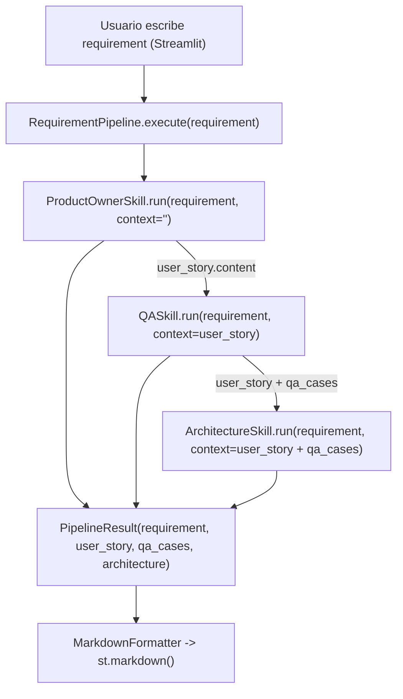
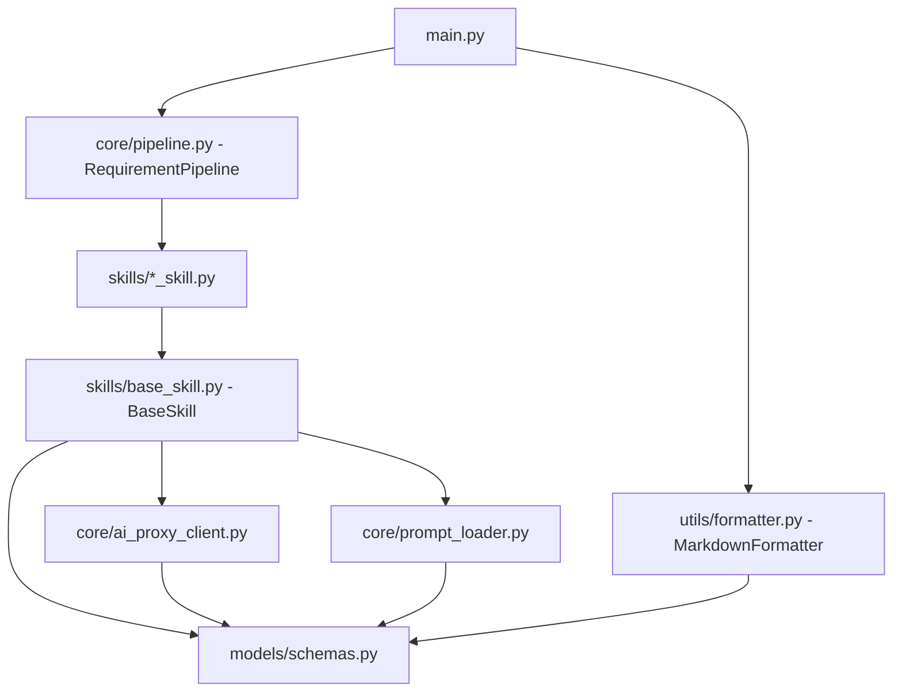

# 01 - Arquitectura

| Anterior | Siguiente |
|----------|-----------|
| [00_overview](00_overview.md) | [02_patterns](02_patterns.md) |

---

## Mapa general

El recorrido del dato es: un `requirement` entra a `RequirementPipeline.execute()`,
pasa por las tres skills en orden, y cada paso recibe el `context` acumulado de
los anteriores. Fíjate en un detalle importante: el contexto **crece** en cada
paso. QA recibe solo la historia de usuario; Arquitectura recibe la historia de
usuario **y** los casos de prueba juntos. Esto es intencional: la recomendación
arquitectónica debe considerar los riesgos que QA ya detectó.

La jerarquía de clases muestra cómo `main.py` llama a `RequirementPipeline`, cómo
las tres skills concretas heredan de `BaseSkill`, y cómo `BaseSkill` depende de
dos piezas de infraestructura (`AIProxyClient` y `PromptLoader`) en lugar de
duplicarlas en cada skill. El diagrama UML completo está en
[07_interfaces](07_interfaces.md).

---

## Capas del sistema

| Capa | Carpeta | Responsabilidad |
|---|---|---|
| Datos | `models/` | Estructuras puras que viajan por el sistema ([04_models](04_models.md)) |
| Infraestructura | `core/` | Cliente de IA, carga de prompts, orquestador ([07_interfaces](07_interfaces.md), [05_pipeline](05_pipeline.md)) |
| Skills | `skills/` | Lógica de cada etapa de análisis ([06_skills](06_skills.md)) |
| Presentación | `utils/`, `main.py` | Formateo a Markdown y la app Streamlit ([07_interfaces](07_interfaces.md)) |

---

## Flujo de datos (cómo crece el `context`)

Punto clave: `QASkill` recibe solo la historia de usuario, pero `ArchitectureSkill`
recibe la historia **más** los casos de prueba combinados, para que la
recomendación considere los riesgos ya detectados por QA.

---

## Dependencias sin ciclos

Una **dependencia circular** ocurre cuando el módulo A necesita importar algo de B,
pero B también necesita importar algo de A — Python no puede resolver eso y falla
al ejecutar. El flujo de importación es siempre de arriba hacia abajo; nunca al
revés.

| Clase / módulo | Depende de |
|---|---|
| `main.py` | `RequirementPipeline`, `MarkdownFormatter`, `PipelineResult` |
| `RequirementPipeline` | `ProductOwnerSkill`, `QASkill`, `ArchitectureSkill`, `PipelineResult` |
| `ProductOwnerSkill`, `QASkill`, `ArchitectureSkill` | `BaseSkill`, `SkillResult` |
| `BaseSkill` | `AIProxyClient`, `PromptLoader`, `AIProxyError`, `PromptNotFoundError`, `SkillResult` |
| `AIProxyClient` | `AIProxyError`, `requests` |
| `PromptLoader` | `PromptNotFoundError`, `pathlib` |
| `MarkdownFormatter` | `SkillResult`, `PipelineResult` |

Flujo global: `main -> pipeline -> skills -> (base_skill, ai_proxy_client, prompt_loader) -> models`.
Usa esta tabla como checklist: si en algún punto necesitas importar algo "hacia
arriba" en esta lista, es señal de que algo está mal diseñado.
