# 07 - Interfaces, infraestructura y presentación

| Anterior | Siguiente |
|----------|-----------|
| [06_skills](06_skills.md) | [08_testing](08_testing.md) |

Este documento reúne la especificación detallada de las piezas de infraestructura
(`core/`), el formateador (`utils/`), la capa de presentación (`main.py`) y el
**diagrama de clases UML completo**.

---

## 1. Cliente del proxy de IA (`core/ai_proxy_client.py`)

### `class AIProxyClient`

Único punto de salida HTTP hacia tu proxy propio (Azure Container Apps). Las skills
nunca llaman directamente a OpenAI/Claude; siempre pasan por aquí. Esto es lo que
te permite no filtrar la API key real del proveedor (patrón Proxy, ver
[02_patterns](02_patterns.md)).

**Atributos de instancia:**

| Atributo | Tipo | Descripción |
|---|---|---|
| `proxy_url` | `str` | URL base de tu proxy, ej. `https://miapp.azurecontainerapps.io` |
| `proxy_api_key` | `str` | Tu API key propia (no la del proveedor real) |
| `timeout` | `float` | Timeout en segundos para la petición HTTP (default `30.0`) |
| `is_available` | `bool` | Calculado en `__init__`: `True` si `proxy_url` y `proxy_api_key` no están vacíos |

#### `__init__(self, proxy_url=None, proxy_api_key=None, timeout=30.0) -> None`

- Si `proxy_url` es `None`, lee `os.getenv("AI_PROXY_URL")`.
- Si `proxy_api_key` es `None`, lee `os.getenv("AI_PROXY_API_KEY")`.
- Calcula `self.is_available`.
- No lanza excepción si faltan credenciales — solo marca `is_available = False`. Esto habilita el fallback a mock sin romper la app (degradación elegante).

#### `complete(self, system_prompt: str, user_message: str, max_tokens: int = 1000) -> str`

- **Retorna:** `str` — el texto de la respuesta ya extraído (no el JSON crudo).
- **Lanza:** `AIProxyError` si la petición HTTP falla, hay timeout, o el proxy responde con error HTTP.
- **Lógica interna:** hace `requests.post(f"{self.proxy_url}/v1/chat", json={...}, headers={"Authorization": f"Bearer {self.proxy_api_key}"}, timeout=self.timeout)`, valida `response.status_code`, parsea el JSON y extrae el campo de texto.

### `class AIProxyError(Exception)`

Excepción propia para distinguir errores de tu proxy de cualquier otro error
inesperado. La lanza `complete()`; la capturan las skills para activar el fallback
mock.

---

## 2. Carga de prompts (`core/prompt_loader.py`)

### `class PromptLoader`

Responsable único de leer los archivos `.md` de `prompts/` y resolver rutas para
que funcione sin importar desde dónde ejecutes la app.

| Atributo | Tipo | Descripción |
|---|---|---|
| `prompts_dir` | `pathlib.Path` | Ruta absoluta resuelta a la carpeta `prompts/` |

#### `__init__(self, prompts_dir=None) -> None`

- Si `prompts_dir` es `None`, la resuelve así: `Path(__file__).resolve().parent.parent / "prompts"`. Calcula la ruta relativa **al propio archivo**, no a la carpeta desde donde ejecutas el comando. Esto evita un bug común: que el proyecto funcione desde una carpeta pero falle desde otra.

#### `load(self, prompt_filename: str) -> str`

- **Retorna:** `str` — contenido completo del archivo, leído con `encoding="utf-8"`.
- **Lanza:** `PromptNotFoundError` si el archivo no existe (capturable, no rompe la interfaz).

### `class PromptNotFoundError(Exception)`

La lanza `load()`; cada skill debe capturarla y caer a un prompt de respaldo,
porque "falta un archivo" también debe degradar de forma segura.

---

## 3. Formateador (`utils/formatter.py`)

### `class MarkdownFormatter`

Transforma un `SkillResult` (o un `PipelineResult` completo) en bloques de Markdown
listos para `st.markdown()`. Mantiene la separación entre lógica de negocio y
presentación. Todos sus métodos son `@staticmethod` (sin estado).

#### `format_skill_result(result: SkillResult, title: str) -> str`

- **Retorna:** `str` — bloque Markdown con encabezado (`## {title}`), una nota visible si `result.is_mock` es `True` (ej. `> Generado en modo mock`), y el `result.content`. Si `result.error` no es `None`, retorna en su lugar un bloque de error formateado.

#### `format_pipeline_result(pipeline_result: PipelineResult) -> str`

- **Retorna:** `str` — concatenación de las 3 llamadas a `format_skill_result()`, separadas por `---`.

---

## 4. Capa de presentación (`main.py`)

No es una clase: Streamlit es script-based, por lo que se usan funciones de módulo.
Streamlit vuelve a ejecutar el archivo completo en cada interacción del usuario.

#### `get_pipeline() -> RequirementPipeline`

- Decorada con `@st.cache_resource` para no recrear clientes/loaders en cada rerun. Sin él, cada interacción crearía un `RequirementPipeline` nuevo, desperdiciando recursos.

#### `render_results(pipeline_result: PipelineResult) -> None`

- Llama a `MarkdownFormatter.format_skill_result()` tres veces (una por sección) y las pasa a `st.markdown(..., unsafe_allow_html=False)`.

#### `main() -> None`

- Punto de entrada del script. Dibuja el `st.text_area` para el requerimiento, el botón de envío, llama a `get_pipeline().execute(requirement)` y luego a `render_results(...)`.

---

## 5. Diagrama de clases UML

> Patrones aplicados: **Pipeline** (secuencia PO -> QA -> Arquitectura),
> **Strategy** (skills intercambiables con la misma firma) y
> **Template Method** (`BaseSkill` define el esqueleto, las subclases completan
> `run()` y `_mock_response()`).

```mermaid
classDiagram
    direction TB

    %% =====================================================================
    %% CAPA DE DATOS (models/schemas.py)
    %% Estructuras puras sin logica; viajan por todo el pipeline.
    %% =====================================================================

    %% SkillResult: formato unico de salida que TODA skill debe devolver.
    class SkillResult {
        <<dataclass>>
        +content str
        +is_mock bool
        +skill_name str
        +error Optional~str~
    }

    %% PipelineResult: informe final que junta los 3 resultados + el requerimiento.
    class PipelineResult {
        <<dataclass>>
        +requirement str
        +user_story SkillResult
        +qa_cases SkillResult
        +architecture SkillResult
    }

    %% =====================================================================
    %% CAPA DE INFRAESTRUCTURA (core/)
    %% Piezas compartidas por las 3 skills (principio DRY).
    %% =====================================================================

    %% AIProxyClient: unico punto de salida HTTP hacia la IA (patron Proxy).
    class AIProxyClient {
        +proxy_url str
        +proxy_api_key str
        +timeout float
        +is_available bool
        +__init__(proxy_url Optional~str~, proxy_api_key Optional~str~, timeout float) None
        +complete(system_prompt str, user_message str, max_tokens int) str
    }

    %% AIProxyError: error propio del proxy; las skills lo capturan para caer a mock.
    class AIProxyError {
        <<Exception>>
    }

    %% PromptLoader: lee los prompts .md resolviendo la ruta con Path(__file__).
    class PromptLoader {
        +prompts_dir Path
        +__init__(prompts_dir Optional~str~) None
        +load(prompt_filename str) str
    }

    %% PromptNotFoundError: se lanza si falta el .md; habilita prompt de respaldo.
    class PromptNotFoundError {
        <<Exception>>
    }

    %% =====================================================================
    %% CAPA DE SKILLS (skills/)
    %% BaseSkill = Template Method; las 3 concretas = Strategy.
    %% =====================================================================

    %% BaseSkill: define el esqueleto de run() (mock vs IA real); NUNCA lanza excepcion.
    class BaseSkill {
        <<abstract>>
        +skill_name str
        +prompt_filename str
        +system_prompt str
        +ai_client AIProxyClient
        +__init__(skill_name str, prompt_filename str, ai_client Optional~AIProxyClient~, prompt_loader Optional~PromptLoader~) None
        +run(requirement str, context str) SkillResult*
        #_mock_response(requirement str) SkillResult*
        #_build_user_message(requirement str, context str) str
    }

    %% ProductOwnerSkill: 1ra estacion; ignora context (no hay previo) -> historia de usuario.
    class ProductOwnerSkill {
        +__init__(ai_client Optional~AIProxyClient~, prompt_loader Optional~PromptLoader~) None
        +run(requirement str, context str) SkillResult
        #_mock_response(requirement str) SkillResult
    }

    %% QASkill: 2da estacion; usa context = historia de usuario -> casos de prueba.
    class QASkill {
        +__init__(ai_client Optional~AIProxyClient~, prompt_loader Optional~PromptLoader~) None
        +run(requirement str, context str) SkillResult
        #_mock_response(requirement str) SkillResult
    }

    %% ArchitectureSkill: 3ra estacion; usa context = historia + casos -> recomendacion.
    class ArchitectureSkill {
        +__init__(ai_client Optional~AIProxyClient~, prompt_loader Optional~PromptLoader~) None
        +run(requirement str, context str) SkillResult
        #_mock_response(requirement str) SkillResult
    }

    %% =====================================================================
    %% ORQUESTADOR (core/pipeline.py)
    %% =====================================================================

    %% RequirementPipeline: ejecuta PO -> QA -> Arquitectura acumulando context.
    class RequirementPipeline {
        +product_owner_skill ProductOwnerSkill
        +qa_skill QASkill
        +architecture_skill ArchitectureSkill
        +__init__(product_owner_skill Optional~ProductOwnerSkill~, qa_skill Optional~QASkill~, architecture_skill Optional~ArchitectureSkill~) None
        +execute(requirement str) PipelineResult
    }

    %% =====================================================================
    %% PRESENTACION (utils/formatter.py y main.py)
    %% =====================================================================

    %% MarkdownFormatter: convierte resultados a Markdown (separa negocio de presentacion).
    class MarkdownFormatter {
        +format_skill_result(result SkillResult, title str) str$
        +format_pipeline_result(pipeline_result PipelineResult) str$
    }

    %% main: capa Streamlit (script-based); get_pipeline() cachea recursos por rerun.
    class main {
        <<module>>
        +get_pipeline() RequirementPipeline$
        +render_results(pipeline_result PipelineResult) None$
        +main() None$
    }

    %% =====================================================================
    %% RELACIONES
    %% =====================================================================

    %% --- Herencia (Template Method / Strategy): misma firma run(), distinta logica ---
    BaseSkill <|-- ProductOwnerSkill : hereda
    BaseSkill <|-- QASkill : hereda
    BaseSkill <|-- ArchitectureSkill : hereda

    %% --- Composicion: el pipeline y el resultado POSEEN a sus partes ---
    RequirementPipeline "1" *-- "1" ProductOwnerSkill : crea/posee
    RequirementPipeline "1" *-- "1" QASkill : crea/posee
    RequirementPipeline "1" *-- "1" ArchitectureSkill : crea/posee
    PipelineResult "1" *-- "3" SkillResult : agrega

    %% --- Asociacion: referencia inyectada por constructor ---
    BaseSkill "1" --> "1" AIProxyClient : ai_client

    %% --- Dependencias: usa / lanza / captura / retorna (sin poseer) ---
    BaseSkill ..> PromptLoader : usa en __init__
    BaseSkill ..> SkillResult : retorna
    BaseSkill ..> PromptNotFoundError : captura
    BaseSkill ..> AIProxyError : captura
    AIProxyClient ..> AIProxyError : lanza
    PromptLoader ..> PromptNotFoundError : lanza
    RequirementPipeline ..> PipelineResult : produce
    MarkdownFormatter ..> SkillResult : formatea
    MarkdownFormatter ..> PipelineResult : formatea
    main ..> RequirementPipeline : orquesta
    main ..> MarkdownFormatter : renderiza
    main ..> PipelineResult : consume

    %% =====================================================================
    %% NOTAS VISUALES (se renderizan como recuadros junto a cada clase)
    %% =====================================================================
    note for SkillResult "Contrato unico de salida. Permite tratar el resultado de cualquier skill por igual (polimorfismo)."
    note for AIProxyClient "Degradacion elegante: si faltan AI_PROXY_URL o AI_PROXY_API_KEY marca is_available=False en vez de fallar."
    note for PromptLoader "Resuelve la ruta relativa al propio archivo, no al directorio de ejecucion. Evita bugs al lanzar streamlit run."
    note for BaseSkill "Contrato de run(): 1) si IA no disponible -> mock; 2) si falla la IA -> mock; 3) nunca lanza excepcion hacia main."
    note for RequirementPipeline "5 lineas de logica. No usa try/except porque run() jamas lanza. Extender = agregar una skill mas a la cadena."
    note for QASkill "Recibe el output de ProductOwnerSkill como context."
    note for ArchitectureSkill "Recibe historia de usuario + casos de prueba combinados como context."
```

---

## 6. Leyenda de notación UML

| Símbolo en el diagrama | Relación | Significado |
|---|---|---|
| `A <|-- B` | Herencia / generalización | `B` es una subclase de `A` y respeta su contrato |
| `A *-- B` | Composición | `A` crea y posee a `B`; si `A` desaparece, `B` también |
| `A --> B` | Asociación | `A` mantiene una referencia a `B` (aquí, inyectada por constructor) |
| `A ..> B` | Dependencia | `A` usa, lanza, captura o retorna `B`, sin poseerlo |
| `<<abstract>>` | Estereotipo | Clase abstracta, no instanciable directamente |
| `<<Exception>>` | Estereotipo | Excepción personalizada |
| `<<dataclass>>` | Estereotipo | Estructura de datos pura, sin lógica |
| `<<module>>` | Estereotipo | Módulo de funciones (no es una clase) |
| `+` / `#` | Visibilidad | `+` público, `#` protegido (prefijo `_` en Python) |
| Método con `*` | Método abstracto | Cada subclase debe implementarlo (`run`, `_mock_response`) |
| Método con `$` | Método estático / de módulo | No depende de estado de instancia |
| `Optional~T~` | Tipo opcional | Equivale a `T \| None` en Python |
